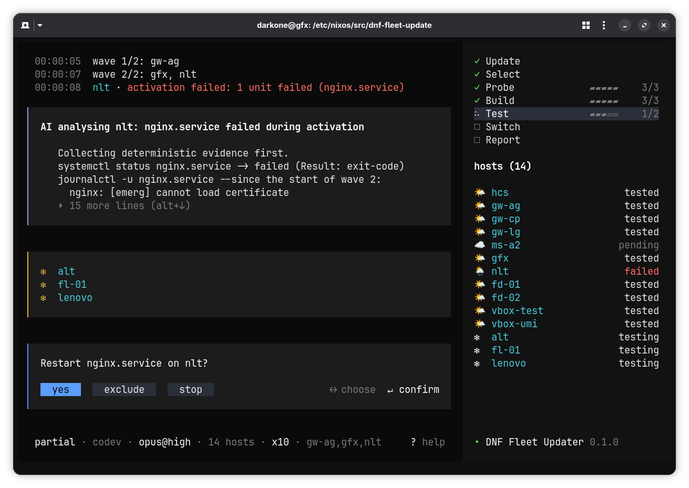

# DNF Fleet Updater

[](#status)
[](https://bun.sh/)
[](https://www.typescriptlang.org/)
[](https://github.com/sst/opentui)
[](https://nixos.org/)
[](https://www.gnu.org/licenses/gpl-3.0)

- Framework: [Darkone NixOS Framework](https://github.com/darkone-linux/darkone-nixos-framework)
- Siblings: [Boilerplate](https://github.com/darkone-linux/dnf-boilerplate) • [Example](https://github.com/darkone-linux/dnf-example) • [Generator](https://github.com/darkone-linux/dnf-generator) • [Documentation](https://github.com/darkone-linux/dnf-doc)

**Update a whole NixOS fleet in one command, and watch it happen.**

`fleet-update` upgrades the flakes, builds every host once, tests the new
configuration wave by wave — the hosts your network depends on first — then
switches everything that passed. It works on any [DNF](https://github.com/darkone-linux/darkone-nixos-framework) consumer project: hosts,
profiles and zones come from your configuration, nothing is hardcoded.



## Highlights

- 🌊 **Deployment in waves.** `hcs` first, then the gateway and hosts of the zone
  you stand in, then the other zones, grouped by profile. A broken
  configuration stops before it reaches the rest of the fleet.
- ❄️ **Native Nix.** One `nix-eval-jobs` evaluation, one build per
  host, then `nix copy` of the exact store path that was built — no
  re-evaluation, no drift if the repository changes mid-run.
- 🛟 **Safe activation.** Runs under `systemd-run` so it survives a dropped SSH
  session; an automatic rollback restores the previous system if the host stays
  unreachable.
- 🔁 **Resumable.** Every event is written to `var/deployments/`; after an
  interruption, `--resume` picks up the hosts left, reusing what was built.
- 🤖 **AI on call, on a leash.** AI (local or remote) analyses failures from
  deterministic evidence (`systemctl status`, `journalctl`, build logs). It
  reaches them through an MCP server the run serves on loopback, and the level
  you asked for is the list of tools it is shown — no free shell, no free SSH,
  every call traced. Repair is being built, see [Status](#status).
- 🖥️ **A terminal interface built for reading.** A feed of what happened,
  panels for what needs attention, and the state of every step and host at a
  glance. Open any host's logs without losing the overview.
- ⏰ **Unattended too.** `--no-ui` produces plain text for a systemd timer, with
  meaningful exit codes and a Matrix report to the alert rooms.
- 🔒 **One run at a time.** A kernel `flock` that cannot be orphaned.

## Status

**Alpha.** v0.6.0 updates, builds, tests and switches a real fleet end to end
from the DNF consumer project it runs in, and reports to the Matrix alert rooms.
On `main`, the AI analyses a failure through its own guarded tools and may act
on the units that fell. One part of the contract below is specified and still
being built:

| Not yet | Options | Today |
|---|---|---|
| AI repair through the code | `--ai-error-action repair` | the AI acts on services; editing, validating and committing a fix comes next |

```bash
nix develop            # or: nix-shell
just install
just mock ai-analysis  # nominal, offline, build-failure, ai-analysis, ai-repair, abort
```

`just mock` replays a recorded event stream in the real interface. The replay
stops on every question and waits for your answer: the interactive path is
exercised, not simulated.

## How it works

| Step | What happens |
|---|---|
| **Update** | `nix flake update` of `dnf/` (codev) and of the consumer, `just clean`, one commit per repository |
| **Select** | hosts, profiles and zones read from `var/generated/`, filtered by `--on`; current zone detected from the local IP |
| **Probe** | parallel pings, offline hosts set aside |
| **Build** | every selected host, online or not, on the deployment machine |
| **Test** | `switch-to-configuration test` wave by wave; the next wave starts once every host is OK or excluded |
| **Switch** | every host validated in test, all at once (`--skip-test`: wave by wave) |
| **Report** | final state, AI summary if enabled, Matrix message if `--send-report` |

A git tree that is not clean, or a lock already held, stops the run before it
starts.

## Usage

```
fleet-update [options]
```

From a DNF consumer project, `just fleet-update [options]` runs the sources in
co-development, else the command installed by the `darkone.admin.fleet-update`
module, else the package pinned by the project's `flake.lock`.

### Selection and order

| Option | Default | Description |
|---|---|---|
| `--on <query>` | all hosts | names, globs, `@tag` or `+profile`, e.g. `"gfx,hcs,gw-*"` or `"@zone-ag,+gateway"` |
| `--deployment-order <profiles>` | `hcs:gateway:server:[others]:laptop` | one wave per profile; `[others]` = profiles not listed |
| `--critical-profiles <profiles>` | `hcs:gateway:server` | failures on these hosts also go to the incidents room |
| `--no-current-zone-before` | | waves by profile across all zones, without testing the current zone first |

A fleet sets its own defaults for the two profile lists in `etc/config.yaml`;
the options still win:

```yaml
network:
  fleetUpdate:
    deploymentOrder: "hcs:gateway:server:[others]:laptop"
    criticalProfiles: "hcs:gateway:server"
```

### Update

| Option | Default | Description |
|---|---|---|
| `--no-dnf-flake` | | skip `nix flake update` of `dnf/` (codev only) |
| `--no-flake` | | skip `nix flake update` of the consumer |
| `--dnf-commit-message <msg>` | `chore(update): regular flake upgrade` | commit message in `dnf/` (codev only) |
| `--commit-message <msg>` | `chore(update): full fleet` | commit message in the consumer (`chore(update): <--on>` for a partial run) |

### Flow

| Option | Description |
|---|---|
| `--build-only` | stop after the build (interactive: ask whether to go on) |
| `--skip-test` | no test step: switch wave by wave, straight from the build |
| `--skip-switch` | no switch step: the run stops on what the test left |
| `--resume` | resume the last unfinished deployment |
| `--non-interactive` | no confirmation at key steps; guards only |

### Output

| Option | Description |
|---|---|
| `--no-ui` | plain text output, forces `--non-interactive` |
| `--send-report` | send the report summary to the Matrix alert rooms |

### AI

| Option | Default | Description |
|---|---|---|
| `--ai-model <tool>[:<model>][@<effort>]` | `claude:opus@high` | e.g. `claude:opus@max`, `opencode:ollama/qwen3:32b` |
| `--ai-analysis none\|passive\|active` | `none` | analysis depth and AI-enriched report |
| `--ai-error-action none\|analysis\|repair` | `none` | what the AI may do when something fails |

Both default to `none`: nothing reaches an AI until you ask. The level is the
higher of the two, and it *is* the list of tools published to the model — what
it is not shown, it cannot ask for:

| Level | Tools |
|---|---|
| `passive` | deployment state, host diagnosis, build and activation logs |
| `active` / `analysis` | + read the code (consumer, `dnf/`), host units and journals, read-only |
| `repair` | + one action on the units this run saw fall, and nothing else |

The built-in tools of `claude` and `opencode` are denied, and so is the project
context they would otherwise pick up (`CLAUDE.md`, user settings). A path leaves
the two readable trees, names `usr/secrets/`, or a host or unit is not one of
the run's — the call is refused, and the refusal is traced like any other call.

At `repair` the AI gets a second session on a failed host, in state `AI repair`,
with one added tool: `systemctl start`, `stop`, `restart` or `reset-failed` on
**the units this run saw fall**, and nothing else. Three attempts per host,
refusals not counted, a confirmation before each one when interactive, and no
action at all once the run is stopping.

Every tool *call* leaves a feed line (`AI reads usr/modules/nginx.nix`) and a
line in `logs/ai.log`; every tool *action* is counted into `state.json` and the
report's **AI repair** section, refusals and their reason included. `report.md` gains an **AI analysis** section: one block per
host analysed, then the end-of-run summary, which also rides along — trimmed —
on the Matrix message. The analysis never replaces a host's raw reason.

### Execution

| Option | Default | Description |
|---|---|---|
| `--max-parallel <n>` | `10` | hosts copied and activated at once within a wave |
| `--rollback-timeout <seconds>` | `600` | automatic rollback of a host left unreachable after activation (`0` = off) |

### Exit codes

| Code | Meaning |
|---|---|
| `0` | done |
| `1` | stopped on error |
| `2` | invalid options |
| `3` | done, report not sent |
| `4` | lock already held |
| `5` | aborted by the user |

## Use cases

**Routine update of the whole fleet**, from the admin workstation:

```bash
fleet-update
```

**Target a few hosts** — hosts, globs, tags and profiles combine:

```bash
fleet-update --on "gfx,fd-*"
fleet-update --on "@zone-ag,+gateway"
```

**Build first, deploy later** — check that everything compiles without
touching a host:

```bash
fleet-update --build-only
```

**Resume after an interruption** (`^C`, lost connection, host fixed by hand).
Options that shape the run (`--on`, `--ai-*`, `--max-parallel`...) may be
overridden:

```bash
fleet-update --resume --on "nlt"
```

**Let the AI explain what failed**, with the code in reach and nothing else:

```bash
fleet-update --ai-analysis passive --ai-error-action analysis
```

**Let it restart what fell too**, confirming each action:

```bash
fleet-update --ai-error-action repair
```

**Unattended nightly run** — what the `darkone.admin.fleet-update` module
schedules with a systemd timer:

```bash
fleet-update --no-ui --send-report
```

Exit code `4` (a run already in progress) is not an error for the service.

## Interface

Read it left to right: the feed tells what happened, the panels carry what
needs attention, the right column gives the overall state.

| Key | Action |
|---|---|
| `q` | quit; leaves the log view when in it |
| `⇥` | move focus between feed and host table |
| `↑↓` | scroll the focused pane; change host in the log view |
| `↵` | selected host → its logs; confirm a question button |
| `←→` | pick a question button |
| `alt+↓` `alt+↑` | expand / collapse the AI answer |
| `a` | free-text question to the AI |
| `^C` | abort: `after wave`, `now` or `cancel` (twice: `now`) |
| `Esc` | close help, AI input, log view; cancel a question |
| `?` | help |

Host states: ☁️ pending · 🌥️ built · 🌤️ tested · ☀️ deployed · 🌦️ failed
(service) · 🌧️ failed (other) · 💤 offline. Excluded hosts are hidden and
counted in the table header.

Needs a terminal of at least 100×24, and a font covering *Symbols for Legacy
Computing* for the panel rules. `--no-ui` covers everything else.

## Development

```bash
nix develop                     # Bun, just, git-cliff
just install                    # dependencies + git hooks (commit-msg, pre-commit)

just mock <scenario>            # replay a scenario in the real interface
just capture <scenario> [ms]    # exact cells of a frame, no terminal
just capture-colors <scenario>  # one line per span: fg, bg, attributes

just check                      # lint + typecheck + tests: the pre-commit gate
just fix                        # apply formatting and safe lint fixes
just test [filter]              # unit and integration tests
just coverage                   # tests with a coverage report
```

Never judge the interface from a pty dump: unchanged cells are not repainted,
neighbouring text looks glued and colours are lost. Use the capture harness.

| Path | Role |
|---|---|
| `src/model/` | event contract (`events.ts`), state fold (`state.ts`), exit codes, theme — pure, no I/O |
| `src/engine/` | orchestration: ports (`ports.ts`), steps, waves, host table, decisions, report |
| `src/adapters/` | real ports: processes, `flock`, run store, loopback MCP server |
| `src/ai/` | the AI as an executable: argv, prompts, tool registry, JSON-RPC, triggers |
| `src/ui/` | OpenTUI components, presentation only |
| `src/testing/` | deterministic frame capture, fakes of the engine ports |
| `src/main.tsx` | composition root: binds a run source to the interface |
| `tests/` | integration tests: entry point as a process, commit gate |
| `mock/scenarios/` | recorded event streams (JSONL) |

The interface never calls the engine: both meet on the event stream of
`src/model/events.ts`, which also feeds `state.json` and `--no-ui`. Biome
enforces these boundaries at lint time.

Runtime: Bun — OpenTUI reaches its Zig core through Bun's FFI.

### Releases

Conventional commits, one line, closed type list — checked by the `commit-msg`
hook and by CI. From the DNF co-development workspace:

```bash
just changelog                  # preview the next CHANGELOG entry
just release [auto|patch|minor|major|X.Y.Z]
```

`just release` runs the CI gate, bumps `package.json`, writes the CHANGELOG
entry, tags and pushes; the tag workflow checks it and publishes the GitHub
release with that entry as notes. The workspace release train does the same
when this repository changed, then pins the tag in the framework package.

## License

[GPL-3.0-or-later](https://www.gnu.org/licenses/gpl-3.0).
